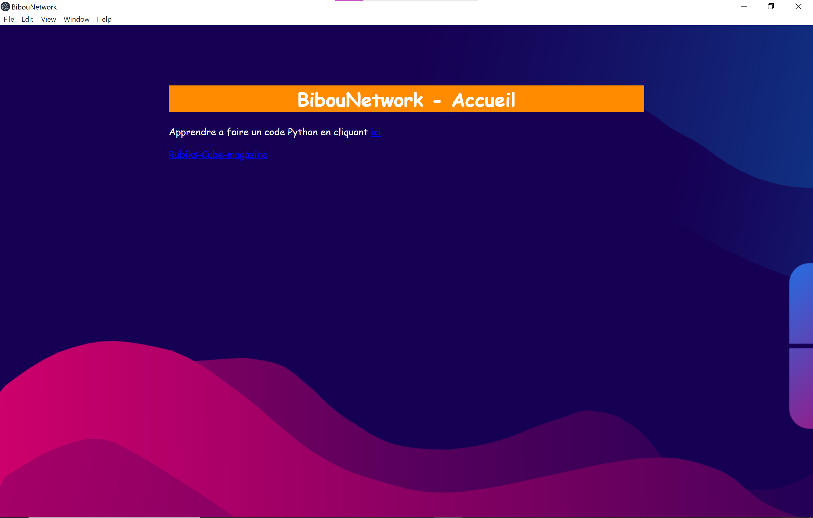

# BibouNetworkAPP
Bienvenue sur la version gui de l'ancienne version de BibouNetwork.
<center></center>

# Installation
Pour commencer vous devez avoir <a href="https://nodejs.org">Node.js</a>. Une fois avoir installer l'application vous devez installer la dernière verison de l'application en cliquant <a href="https://github.com/Bibou1494/BibouNetworkAPP/releases">ici</a>. Après ça ouvrez un terminal de commande tel que CMD ou PowerShell. Ensuite diriger vous dans le bon répertoire en utilisant 
```
$ cd nom du fichier
```
jusqu'au bon répertoire ou le fichier a été installer faites ensuite vous devez extraire les fichier dans un répertoire et diriger vous dans se répertoire avec cd dans le terminal et une fois dans le répertoire verifier bien que tout les fichier du code source sans dans se dossier et si tout est là faites 
```
$ npm install electron
```
et une fois l'opération finis faites
```
$ npm start
```
et l'appli est ouvert en vrai appli.

# Customization
Vous pouvez modifier vu que c'est un template vous pouvez modifiez comme un site normal juste le php n'est pas compatible.
